# Packer-Terraform
Clone this repo to your local machine.

## Configure AWS Credentials
Get your AWS credentials from AWS Academy and export them as environment variables:
```
% export AWS_ACCESS_KEY_ID="your aws_access_key_id"
% export AWS_SECRET_ACCESS_KEY="your aws_secret_access_key"
% export AWS_SESSION_TOKEN="your aws_session_token"
```

## Create a custom AWS AMI using Packer 
Check if you already have packer installed on your machine:
```
% packer
```
If not, run the following commands to install packer:
```
% brew tap hashicorp/tap
% brew install hashicorp/tap/packer
``` 
Install Amazon plugin on packer: 
```
% packer plugins install github.com/hashicorp/amazon
```
In the root directory, create a key pair using Amazon EC2 (You need to have AWS CLI preinstalled):
```
% aws ec2 create-key-pair \
    --key-name ami-key-pair \
    --key-type rsa \
    --key-format pem \
    --query "KeyMaterial" \
    --output text > ami-key-pair.pem
```
You can also name the key pair on your preference. But be sure to change the value of "ssh_keypair_name" and "ami-key-pair" in aws-ami-docker.json if you do so.

For future connection to ec2 instances launched by the custom AMI, run the following command to set the permissions of your private key file:
```
% chmod 400 ami-key-pair.pem
```
Note: It is not recommended to change the path of the private key file, because packer config file use the specific location for image creation.
If you move it, be sure to update the path in aws-ami-docker.json at the same time.

Create a custom AMI with **docker** and **ssh public key** set up:
```
% cd packer
% packer build aws-ami-docker.json  
```
You will see packer building logs. Once the process is completed, you will see outputs like the following:
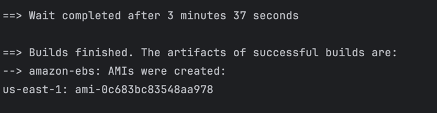

You will be able to see the AMI with the Id specified in the packer build output in AWS Console:
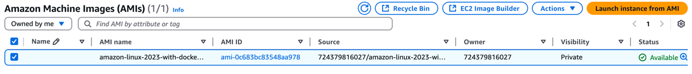


## Use Terraform to provision AWS resources
Check if you already have terraform installed on your machine:
```
% terraform
```
If not, run the following commands to install packer:
```
% brew tap hashicorp/tap
% brew install hashicorp/tap/terraform
``` 
At terraform directory, run the following commands to provision AWS resources
```
$ cd terraform
$ terraform init
$ terraform plan
$ terraform apply
```
After execution, you will see output like this for `terraform apply`:
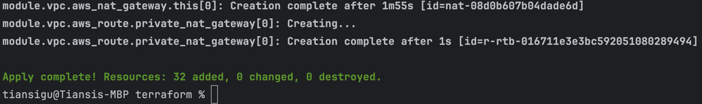
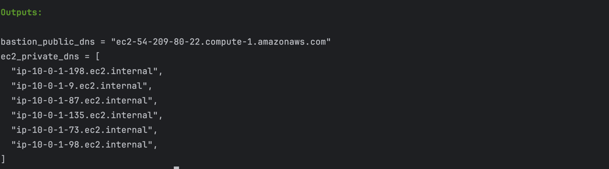

Now you can check the resources terraform just created on your AWS console:
#### VPC
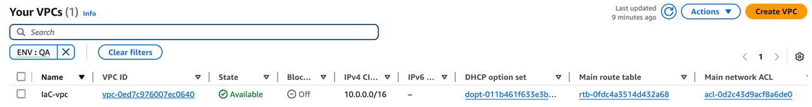

Public subnets are connected to the internet through IGW (Internet Gateway, created together with VPC).
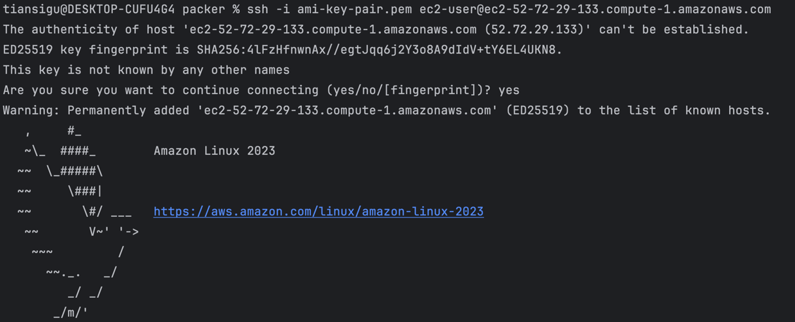
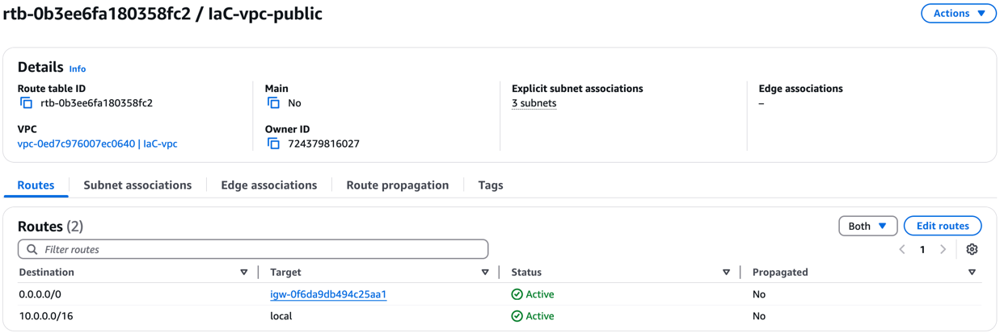
Private subnets can connect to outside through NGW (NAT Gateway, created together with VPC).
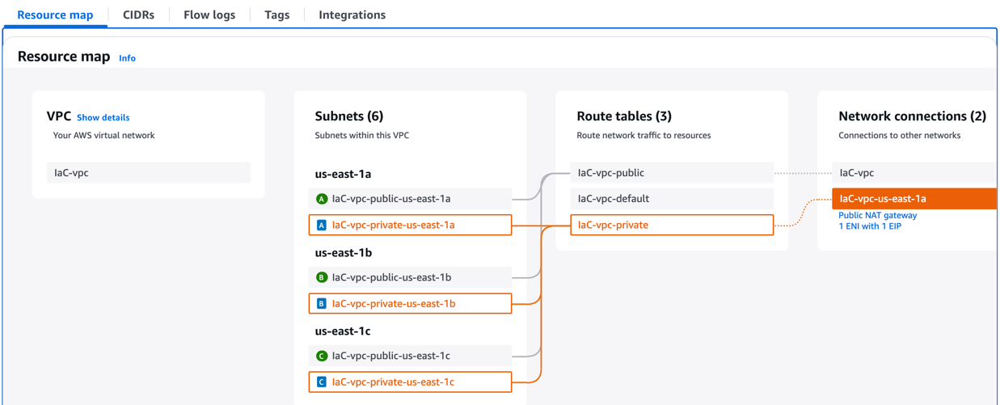
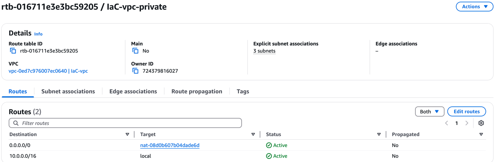
IGW, NGW, and Elastic IP associated to the NGW allocated through the creation of VPC:
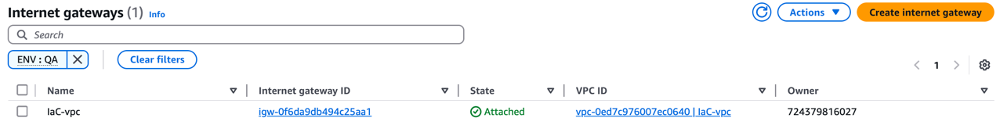
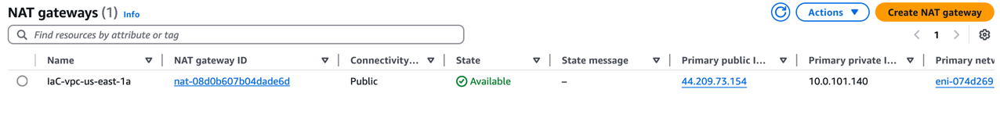
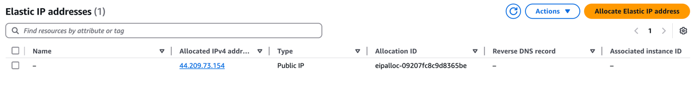

#### EC2
All the ec2 instances launched:

##### Bastion Host
Bastion Host locates in a public subnet, and was created with the newest official AMI of Amazon Linux 2023 (provided by Amazon)
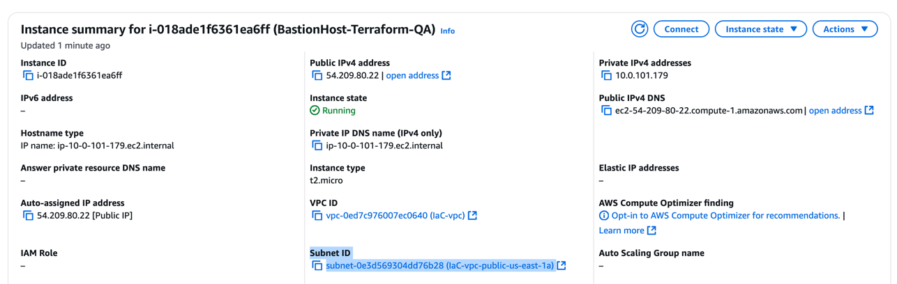
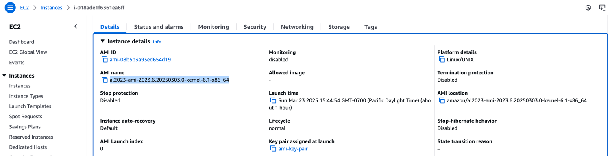

Out of security, the Bastion Host only allows inbounding SSH traffic from your IP address
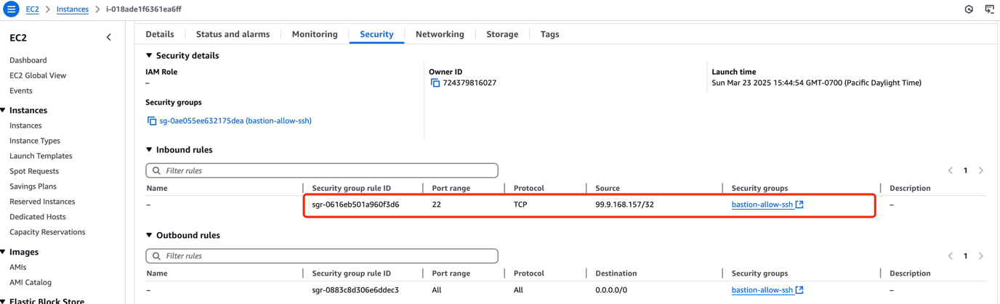
You can verify your IP address by running `curl -s https://api.ipify.org `:
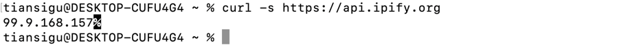

##### Custom EC2
Bastion Host locates in a private subnet, and was created with your new AMI created from Packer
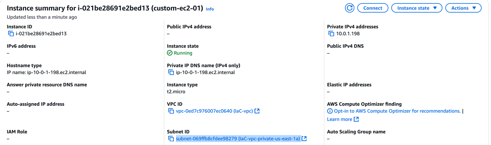
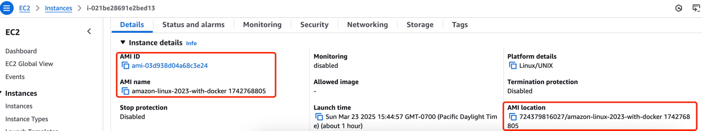

All the custom ec2 instances only allows inbounding SSH traffic from the Bastion Host
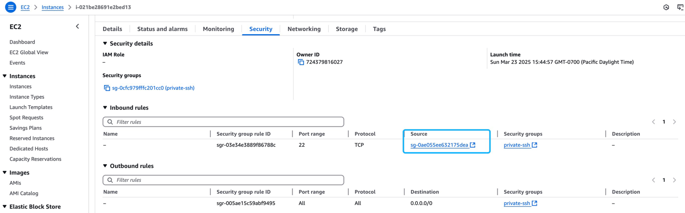
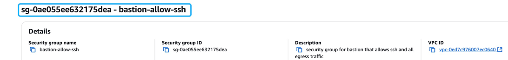

## SSH into Private EC2 via Bastion Host
To get the public DNS of the bastion host and the private DNS of the custom ec2 you want to ssh into, you can either find them in AWS console,
or run in terraform directory:
```
terraform output
```
Example output:
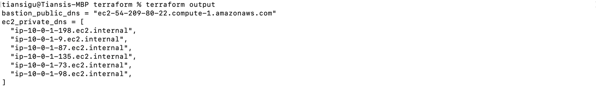

Add the key in the root directory into SSH agent:
```
% ssh-add ami-key-pair.pem
```
SSH into the bastion host with agent forwarding:
```
% ssh -A -i ami-key-pair.pem ec2-user@[your-bastion-host-public-ipv4-dns]
```
Once you are inside the bastion host, SSH into your custom ec2 instance in the private subnet
```
% ssh ec2-user@[your-custom-ec2-private-ipv4-dns]
```
Example output:
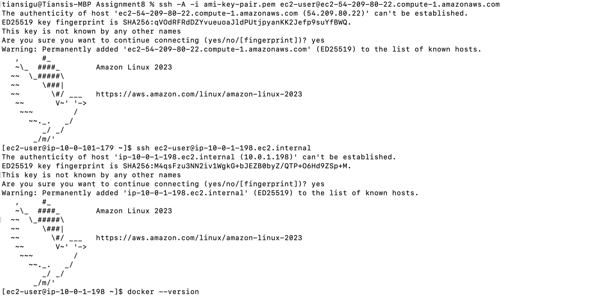
In ec2.tf, no key-pair is associated to the ec2 instance. However, you can still use the private key file to ssh into this EC2 as the public key has been pre-configured in the custom AMI, and thus was pre-set in the ec2

Run some docker commands to verify docker is ready to use:
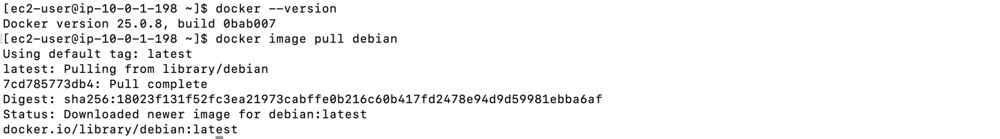